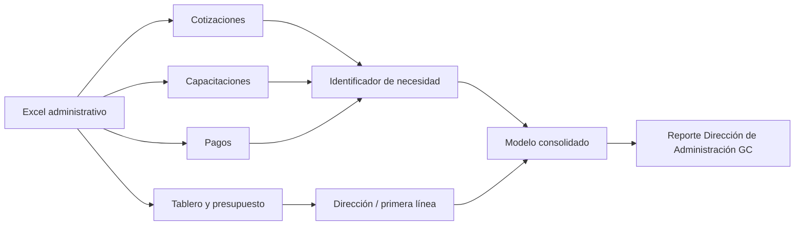
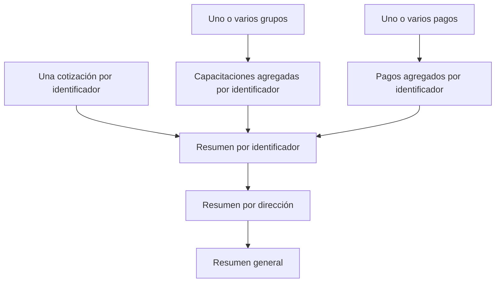

# Dirección de Administración GC

> [!NOTE]
> Documento funcional y técnico del reporte administrativo publicado dentro de la colección **Planes de capacitación**. Describe qué busca explicar, cómo se navega, de dónde obtiene los datos y cómo transforma el Excel antes de publicarlo.

## 1. Resumen ejecutivo

**Dirección de Administración GC** es un informe de seguimiento presupuestal y operativo de los planes de capacitación. Su propósito es explicar, en una sola vista, qué se solicitó, qué se está gestionando, qué ya se impartió, cuánto se ha invertido y cuánto del gasto ya fue cargado contablemente.

El reporte une cuatro perspectivas que en el Excel viven separadas:

1. Plan autorizado y presupuesto.
2. Cotizaciones y selección de proveedor.
3. Capacitaciones, grupos y participantes.
4. Pagos y cargos al centro.

No sustituye al archivo operativo. Convierte su estado actual en una lectura ejecutiva, navegable y filtrable.



## 2. Qué busca explicar

El informe responde principalmente estas preguntas:

- ¿Cuántas necesidades estaban contempladas en el plan autorizado?
- ¿Cuáles surgieron como extra plan?
- ¿Cómo se distribuyen las solicitudes entre cursos, eventos, programas ejecutivos, certificaciones, membresías y suscripciones?
- ¿Cuántas capacitaciones están en preparación, en curso o impartidas?
- ¿Cuántas personas estaban proyectadas y cuántas participaron realmente?
- ¿Cuánto presupuesto fue autorizado, proyectado, invertido y queda por ejercer?
- ¿Cuánto se pagó y cuánto ya fue cargado al centro contable?
- ¿Qué áreas concentran más presupuesto, inversión o capacitaciones?
- ¿Qué categorías, modalidades y rangos de inversión por persona concentran la actividad?
- ¿Qué colaboradores acumulan la mayor inversión estimada en capacitación?

## 3. Alcance organizacional

El filtro superior trabaja con las unidades que el **Tablero** del Excel presenta como primera línea de la Dirección de Administración:

- Dirección Corporativa Eficiencia y Evaluación de Proyectos.
- Dirección Corporativa de Seguridad de la Información.
- División de Administración.
- División de Compras Internas.
- División de Seguridad.
- Nacional de Proyectos Administración.
- VADUM.

> [!IMPORTANT]
> En este informe esas unidades son la dimensión principal de navegación. La columna llamada “Dirección C-Level” en las hojas operativas no se toma literalmente como una lista de C-Level corporativos; el SQL normaliza la primera línea real mostrada en el Tablero.

VADUM permanece disponible como filtro y detalle. El total corporativo del Excel excluye VADUM cuando así lo hace el renglón **TOTAL** del Tablero.

## 4. Cómo funciona el reporte

### 4.1 Portada y selección

La portada muestra el reporte como un capítulo dentro de **Planes de capacitación**. Al abrirlo, DataStore carga el último periodo común disponible y permite cambiar la unidad seleccionada.

### 4.2 Filtros

Los filtros afectan de forma conjunta los indicadores y las tablas:

- Área o primera línea.
- Periodo publicado.
- Estatus, en la lista de planes y capacitaciones.
- Búsqueda por nombre, identificador o proveedor.

### 4.3 Secciones visibles

| Sección | Qué muestra | Fuente principal |
|---|---|---|
| Resumen presupuestal | Presupuesto autorizado, inversión actual, saldo por ejercer y avances | `Tablero` + `Pagos` |
| Solicitados en Plan Autorizado | DNCs, extra plan, cursos, eventos, programas ejecutivos, certificaciones, membresías, suscripciones y personas proyectadas | `Tablero` |
| Distribución por clusters | Participantes por rango de precio negociado por persona | `Capacitaciones en seguimiento` |
| Cursos por modalidad | Cursos únicos y grupos por modalidad normalizada | `Capacitaciones en seguimiento` |
| Presupuesto por categoría | Participación de la inversión por tipo de iniciativa | Cruce consolidado por identificador |
| Ranking de colaboradores | Personas con mayor inversión estimada y número de cursos | Detalle de participantes en capacitaciones |
| Flujo operativo | Avance de cotizaciones, capacitaciones y pagos | Tres hojas operativas |
| Detalle por área | Presupuesto, inversión, avance y número de capacitaciones por primera línea | Resumen por dirección |
| Planes y capacitaciones | Seguimiento individual de cada iniciativa, su estatus, proveedor e inversión | Cruce consolidado por identificador |

## 5. Archivo fuente y modelo maestro

El proceso usa `EIC Maestro.sql` y acepta archivos de la familia:

```text
EIC - Restringida - Vista Cliente <C-Level>.xlsx
```

Por ejemplo, funcionan tanto `EIC - Restringida - Vista Cliente Administrativa.xlsx`
como `EIC - Restringida - Vista Cliente Estrategia y Crecimiento.xlsx`. RunSQL
reconoce el prefijo de la familia, detecta la fila real de encabezados de cada
pestaña y entrega al SQL un esquema normalizado.

Las variaciones equivalentes también se homologan. Actualmente
`Presupuesto Asignado` se convierte en `Presupuesto Autorizado`, por lo que no
es necesario mantener un SQL completo por C-Level.

### 5.1 Hojas utilizadas

| Hoja | Rango leído | Grano original | Uso |
|---|---:|---|---|
| `Estatus de cotizaciones` | `A6:K` | Una necesidad o identificador | Necesidad, estatus de cotización, proveedor y dirección |
| `Capacitaciones en seguimiento` | `A6:AF` | Un grupo de capacitación | Fechas, modalidad, participantes, precio y estatus del grupo |
| `Pagos` | `A5:U` | Un movimiento de pago | Importe, factura, fechas, pago y cargo al centro |
| `Tablero` | Encabezado detectado en `A:U` | Una primera línea y un total | Plan autorizado, participantes y presupuesto |
| `Guía Estatus` | No se carga como tabla | Catálogo explicativo | Referencia humana para interpretar los estatus |

Los rangos quedan abiertos al final, por ejemplo `A6:AF`, para aceptar filas
nuevas. En los archivos EIC, RunSQL valida además encabezados característicos
de cada pestaña; esto permite absorber desplazamientos como `Tablero` en fila 4
o fila 5 sin modificar el SQL.

## 6. Mapeo del Excel al modelo

### 6.1 Cotizaciones

| Columna del Excel | Campo normalizado | Uso en el informe |
|---|---|---|
| `Identificador` | `identificador` | Llave que conecta las hojas |
| `Nombre del curso sugerido` | `nombre_necesidad` | Nombre de respaldo de la iniciativa |
| `Estatus de la necesidad` | `estatus_necesidad` | Determina si la necesidad sigue activa |
| `Tipo de DNC` | `tipo` | Categoría de la iniciativa |
| `Proveedor Sugerido` | `proveedor_sugerido` | Referencia operativa |
| `Proveedor seleccionado` | `proveedor_seleccionado` | Proveedor confirmado |
| `Estatus de las cotizaciones` | `estatus_cotizacion` | Avance del proceso de cotización |
| `Gerencia Divisional` | `gerencia_divisional` | Apoyo para completar la dirección |
| `Dirección Corporativa` | `direccion_c_level` | Primera línea normalizada |
| `Entidad Legal Empleadora` | `unidad_negocio` | Empresa o unidad de negocio |

El orden de avance usado para cotizaciones es:

```text
Eliminado
  → En proceso de cotización
  → Por seleccionar proveedor por cliente
  → Proveedor Seleccionado
```

### 6.2 Capacitaciones

| Columna del Excel | Campo normalizado | Uso en el informe |
|---|---|---|
| `Identificador` | `identificador` | Unión con cotización y pagos |
| `Nombre de la capacitación seleccionada` | `nombre_capacitacion` | Nombre principal |
| `Tipo` | `tipo` | Categoría presupuestal |
| `Asesor` | `asesor` | Responsable de seguimiento |
| `Estatus Grupo` | `estatus_grupo` | Situación operativa de la capacitación |
| `Estatus de contratación` | `estatus_contratacion` | Situación contractual independiente |
| `Nivel 2 (Reporte Directo al C-Level / Primera Línea)` | `direccion_c_level` | Área del reporte |
| `Proveedor Seleccionado` | `proveedor_seleccionado` | Proveedor utilizado |
| `Grupos Cotizados` | `grupos_cotizados` | Cantidad prevista de grupos |
| `#Pax Proyectados` | `pax_proyectados` | Personas planeadas |
| `#Pax reales por grupo` | `pax_reales` | Personas reales por grupo |
| `Datos de Pax Reales (Se obtiene desde Tabla Listas)` | Participantes normalizados | Número, nombre, puesto y centro |
| `Modalidad` | `modalidad` | Online, presencial, híbrida u otra |
| `Fecha de inicio` / `Fecha Fin` | Fechas normalizadas | Vigencia de la capacitación |
| `Precio negociado x persona (en pesos sin IVA)` | `precio_persona_mxn` | Clusters y ranking |
| `Total negociado por grupo (en pesos sin IVA)` | `total_negociado_grupo_mxn` | Inversión negociada de seguimiento |

El estatus principal de una iniciativa es el estatus más avanzado entre sus grupos. La secuencia utilizada es:

```text
Eliminado
  → Negociación de precios con proveedores
  → En espera de fecha de apertura por proveedor
  → Revisando fecha con proveedor
  → Proponer y confirmar fecha con el cliente
  → Inscripción de participantes
  → En proceso de confirmar inscripción a cliente
  → Por impartir
  → Capacitación en curso
  → Impartido
```

### 6.3 Pagos

| Columna del Excel | Campo normalizado | Uso en el informe |
|---|---|---|
| `Identificador` | `identificador` | Unión con la iniciativa |
| `Concepto de pago` | `concepto_pago` | Descripción del movimiento |
| `Monto pagado en pesos sin IVA` | `monto_mxn` | Inversión y flujo de pagos |
| `Folio de factura` / `Folio Fiscal de Factura` | Folios | Orden y trazabilidad |
| `Fecha de factura` | `fecha_factura` | Trazabilidad del documento |
| `Fecha de autorización pago factura (Gerente ADC)` | `fecha_autorizacion` | Avance de pago |
| `Fecha compra Corp/TDC/CxC` | `fecha_compra` | Ejecución del pago |
| `Fecha de cargo al centro` | `fecha_cargo_centro` | Avance contable |
| `¿Pagado?` | `estatus_pago_origen` | Pendiente o ejecutado |

La clasificación final es:

- **Pendiente de pago:** aún no se ejecuta.
- **Pagado - sin fecha de cargo al centro:** ya se pagó, pero aún no se refleja contablemente en el centro.
- **Pagado - con fecha de cargo al centro:** pago ejecutado y cargado al centro.

### 6.4 Tablero y presupuesto

| Columna del Excel | Uso |
|---|---|
| `Dirección C-Level` | Unidad o primera línea de navegación |
| `DNCs` | Necesidades dentro del plan |
| `Extra Plan` | Necesidades fuera del plan |
| `Cursos`, `Eventos`, `Programas Ejecutivos`, `Certificaciones`, `Membresía`, `Suscripción` | Desglose de solicitados |
| `# Pax Proyectados` | Participantes proyectados |
| `#Pax Reales` | Participantes reales del tablero |
| `Presupuesto Autorizado` | Base del presupuesto |
| `Inversión Proyectada` | Compromiso proyectado |
| `Inversión Actual` | Inversión vigente presentada en portada |
| `Presupuesto por ejercer` | Saldo disponible |
| `% Avance de Presupuesto` | Avance reportado por el libro |

> [!WARNING]
> El Tablero contiene fórmulas. Antes de cargar el archivo, debe abrirse, recalcularse y guardarse en Excel para que RunSQL reciba valores actualizados. El reporte no puede corregir una fórmula rota o un valor sin recalcular.

## 7. Normalización y consolidación

### 7.1 Limpieza

El SQL:

- Elimina espacios repetidos y convierte textos vacíos en nulos.
- Convierte importes con `$`, comas o `%` a números.
- Convierte fechas de Excel, ISO y `DD/MM/AAAA` a fechas reales.
- Homologa variantes como `División de Vadum` a `VADUM`.
- Completa direcciones faltantes mediante la gerencia divisional más frecuente encontrada en otras hojas.

### 7.2 Prevención de duplicados monetarios

Una necesidad puede tener varios grupos y varios pagos. Si se unieran las tres hojas directamente, cada grupo podría multiplicarse por cada pago.

Por eso el proceso sigue este orden:



### 7.3 Participantes

El detalle de participantes viene dentro de una celda con el patrón:

```text
número - nombre - puesto - centro
```

El SQL separa cada participante y construye una fila individual. Esa tabla alimenta los clusters y el ranking. Si el texto no respeta el patrón, el participante puede contarse en el total del grupo pero no aparecer en el ranking.

## 8. Definiciones de indicadores

### Presupuesto

\[
\text{Avance de presupuesto}=
\frac{\text{Inversión actual del Tablero}}{\text{Presupuesto autorizado}}
\]

\[
\text{Avance contable}=
\frac{\text{Monto pagado con fecha de cargo al centro}}{\text{Presupuesto autorizado}}
\]

\[
\text{Presupuesto no cargado}=
\text{Presupuesto autorizado}-\text{Monto cargado al centro}
\]

### Clusters de inversión individual

| Orden | Rango |
|:---:|---|
| 1 | Hasta $10,000 |
| 2 | $10,001–$25,000 |
| 3 | $25,001–$50,000 |
| 4 | $50,001–$75,000 |
| 5 | Más de $75,000 |

Sólo participan registros con un precio por persona mayor a cero.

### Modalidad

El texto se normaliza así:

- Contiene `presencial` → **Presencial**.
- Contiene `híbrida` o `mixta` → **Híbrida**.
- Contiene `online`, `línea`, `virtual`, `remota` o `e-learning` → **Online**.
- Cualquier otro valor se conserva o se muestra como **Sin modalidad**.

### Inversión por categoría

Agrupa las iniciativas por `Tipo` y suma la inversión registrada en pagos para los identificadores correspondientes.

### Ranking de colaboradores

Agrupa por número de colaborador, cuenta cursos distintos y suma el precio negociado por persona. Es una inversión atribuida a la participación, no necesariamente el pago contable definitivo.

## 9. Controles de calidad

El SQL genera controles antes de publicar:

- Identificadores duplicados en cotizaciones.
- Capacitaciones sin cotización.
- Pagos sin cotización.
- Cotizaciones sin dirección catalogada.
- Diferencia entre inversión calculada y Tablero.
- Participantes reales sin detalle normalizable.
- Número esperado de unidades de primera línea.
- Diferencia entre el presupuesto de las áreas y el total corporativo.

Los controles pueden resultar en:

- `PASS`: conciliación correcta.
- `WARN`: dato utilizable con una limitación que debe revisarse.
- `FAIL`: diferencia estructural o financiera que debe corregirse antes de confiar en el resultado.

## 10. Fecha de corte

`--d(AAAA-MM-DD)` reemplaza la fecha de `parametros_eic_maestro` y define el periodo publicado.

> [!IMPORTANT]
> En este reporte administrativo la fecha identifica la fotografía cargada; no filtra automáticamente cada fila operativa por fecha. El contenido representa el estado completo del Excel en el momento de la ejecución.

El mismo comportamiento aplica a cada capítulo C-Level publicado dentro de
`Planes de capacitación`.

## 11. Publicación con RunSQL

### Primera migración y cambio de nombre

```text
start --d(2026-08-31) --t(e) --n(Estatus planes de capacitación, Dirección de Administración GC) --l(Planes de capacitación)
```

Esto conserva la clave del reporte anterior, cambia su nombre visible y lo mueve a la colección nueva.

### Actualización normal con el mismo nombre

```text
start --d(2026-08-31) --t(e) --n(Dirección de Administración GC)
```

El segundo valor de `--n` es opcional. Con un solo nombre, RunSQL publica sobre la misma clave y conserva la colección ya asignada.

### Sintaxis de `--n`

| Sintaxis | Resultado |
|---|---|
| `--n(nombre)` | Usa ese nombre como identidad y nombre visible; si ya existe en el periodo permitido, lo reemplaza con el mismo nombre |
| `--n(nombre actual, nombre nuevo)` | Conserva la identidad del nombre actual y cambia únicamente el nombre visible |

### Reglas de reemplazo

| Familia | Regla |
|---|---|
| Planes de capacitación | `--n(nombre)` puede actualizar el capítulo con el mismo nombre; el segundo nombre sólo se usa para renombrarlo |
| Encuesta de satisfacción | `--n(Encuesta de satisfacción)` actualiza el reporte con la misma identidad |
| Tienda | Sólo se reemplaza automáticamente cuando coinciden el nombre y la fecha exacta de corte |

> [!CAUTION]
> Para Tienda, si existe el mismo nombre dentro del mismo periodo mensual pero la fecha exacta es distinta, RunSQL detiene la publicación en lugar de sobrescribir silenciosamente el corte.

## 12. Qué se publica en Firebase

RunSQL no envía el Excel completo. Publica vistas compactas y fragmentadas:

```text
general
c_level
directions
initiatives
quotation_status
training_status
payment_status
training_groups
participants
authorized_plan
cluster_distribution
modality_distribution
budget_categories
collaborator_ranking
payments
controls
```

DataStore consulta esas vistas para construir cada sección del informe.

## 13. Solución de problemas

<details>
<summary><strong>La colección Planes de capacitación no aparece</strong></summary>

Confirma que la publicación terminó correctamente y que el reporte quedó enlazado con `--l(Planes de capacitación)`. Después de la primera publicación, las actualizaciones con el mismo nombre conservan esa colección.

</details>

<details>
<summary><strong>El Tablero muestra ceros o valores desactualizados</strong></summary>

Abre el Excel original, permite que termine el recálculo de fórmulas, guarda el archivo y vuelve a cargarlo.

</details>

<details>
<summary><strong>El ranking tiene menos personas que el total real</strong></summary>

Revisa el formato de `Datos de Pax Reales`. Cada persona debe conservar el patrón `número - nombre - puesto - centro`.

</details>

<details>
<summary><strong>La inversión no coincide con pagos</strong></summary>

La portada usa la inversión actual del Tablero; el avance contable usa pagos con fecha de cargo al centro. Son conceptos distintos y pueden diferir mientras el proceso contable sigue abierto.

</details>

## 14. Archivos técnicos relacionados

- SQL: `EIC Administrativa.sql`.
- Excel: `EIC - Restringida - Vista Cliente Administrativa.xlsx`.
- Publicador: `backend/app/firebase_publish.py`.
- Interfaz de carga: `frontend/src/App.tsx`.
