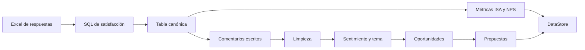
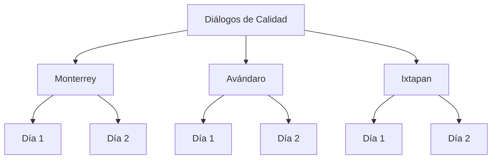
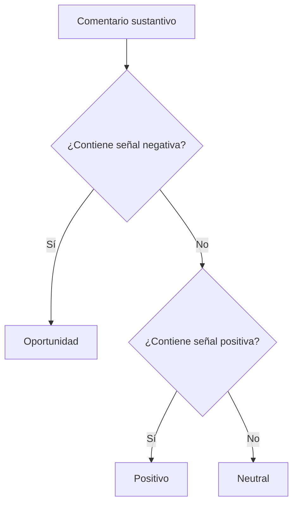
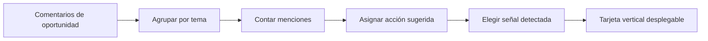

# Encuesta de satisfacción

> [!NOTE]
> Documento funcional y técnico del informe de **Encuesta de satisfacción**. Explica qué muestra, cómo obtiene las respuestas del Excel, cómo calcula ISA y NPS, cómo funcionan los filtros y cómo convierte comentarios escritos en temas, oportunidades y propuestas de mejora.

## 1. Resumen ejecutivo

El informe de **Encuesta de satisfacción** convierte las respuestas de distintos formularios de capacitación en una lectura unificada sobre:

- Satisfacción con la experiencia.
- Desempeño de instructores y equipos facilitadores.
- Recomendación mediante NPS.
- Resultados por programa, curso, instructor, región y periodo.
- Comentarios positivos, neutrales y oportunidades.
- Temas repetidos y propuestas de acción.

El objetivo no es mostrar únicamente un promedio. Busca explicar **qué está funcionando, dónde existen señales de mejora y qué puede hacerse en la siguiente sesión**.



## 2. Qué busca explicar

El reporte responde estas preguntas:

- ¿Cuántas encuestas existen en el periodo seleccionado?
- ¿Cuál es el nivel de satisfacción general?
- ¿Qué rubros tienen mejor o peor evaluación?
- ¿Cuál es el NPS de los instructores, cursos o programas?
- ¿Cómo cambia el ISA entre meses?
- ¿Qué instructores tienen mejores resultados dentro de la selección?
- ¿Qué programas concentran más respuestas?
- ¿Qué están diciendo los participantes con sus propias palabras?
- ¿Cuáles comentarios son señales concretas de mejora?
- ¿Qué acciones pueden tomar los instructores o responsables del programa?

## 3. Archivo fuente

El proceso espera el archivo lógico:

```text
Encuesta de satisfacción.xlsx
```

El SQL consume exclusivamente las hojas originales de respuestas de Forms. No utiliza hojas como `Concentrado General`, `General`, `Comentarios`, `Síntesis` o respaldos calculados.

> [!IMPORTANT]
> Esta decisión evita contar dos veces una respuesta y reduce la dependencia de fórmulas, importaciones o capturas manuales. La fuente de verdad son las respuestas originales.

## 4. Hojas utilizadas

| Hoja original | Programa publicado | Curso publicado | Región |
|---|---|---|---|
| `Competencias` | Competencias del Líder Coppel | Competencias del Líder Coppel | Se toma del formulario |
| `LAC 1,2,3,4` | Liderazgo consciente | Bloque seleccionado | No disponible |
| `SF` | Servicios financieros | Servicios financieros | No disponible |
| `Entrevista` | HCPP | Curso seleccionado | No disponible |
| `Optica` | Óptica | Óptica | No disponible |
| `Form Conductores` | Conductores | Conductores | No disponible |
| `Curso HAMI` | HAMI | HAMI | No disponible |
| `DDC MTRY 1` | Diálogos de Calidad (DDC) | DDC · Día 1 | Monterrey |
| `DDC MTRY 2` | Diálogos de Calidad (DDC) | DDC · Día 2 | Monterrey |
| `DDC AVANDARO 1` | Diálogos de Calidad (DDC) | DDC · Día 1 | Avándaro |
| `DDC AVANDARO 2` | Diálogos de Calidad (DDC) | DDC · Día 2 | Avándaro |
| `DDC IXPN 1` | Diálogos de Calidad (DDC) | DDC · Día 1 | Ixtapan |
| `DDC IXPN 2` | Diálogos de Calidad (DDC) | DDC · Día 2 | Ixtapan |

### Nombres normalizados

Algunos nombres visibles son distintos al nombre de la hoja:

- `Entrevista` se publica como **HCPP**.
- `LAC 1,2,3,4` se publica como **Liderazgo consciente**.
- Las seis hojas DDC se agrupan como **Diálogos de Calidad (DDC)**.
- `Optica` se muestra como **Óptica**.

## 5. Tabla canónica

Todas las hojas se convierten a la misma estructura:

| Campo | Significado |
|---|---|
| `fecha` | Marca temporal de la respuesta |
| `programa` | Programa normalizado |
| `curso` | Curso, bloque o día evaluado |
| `instructor` | Instructor seleccionado o equipo facilitador |
| `region` | Región declarada o sede DDC |
| `puesto` | Puesto cuando está disponible |
| `dominio` | Evaluación de dominio o preparación |
| `comunicacion` | Claridad de comunicación |
| `interes` | Interés y compromiso o experiencia DDC Día 1 |
| `participacion` | Ambiente y participación o cumplimiento del objetivo DDC |
| `resolucion` | Resolución de dudas o atención del equipo coordinador DDC |
| `recomendacion` | Respuesta utilizada para NPS cuando existe |
| `comentario` | Comentario escrito o concatenación de respuestas abiertas |
| `fuente_formulario` | Hoja de origen |
| `escala_recomendacion` | `1-10`, `1-5` o `Sin NPS` |

La tabla final se llama:

```text
resultados_satisfaccion
```

RunSQL exige esa tabla cuando el reporte se publica con `--t(s)`.

## 6. Cómo se toman los datos del Excel

### 6.1 Formularios estándar

En los programas estándar se leen:

- Marca temporal.
- Programa o bloque.
- Instructor.
- Preguntas de evaluación de 1 a 5.
- Recomendación de 1 a 10.
- Comentario adicional.

Los encabezados no son idénticos en todas las hojas. El SQL mapea cada pregunta al campo canónico correspondiente.

### 6.2 Competencias del Líder Coppel

Esta hoja incluye región y puesto. Sus rubros utilizados son:

- Dominio de los temas.
- Comunicación clara y comprensible.
- Participación, interacción y confianza.
- Disponibilidad para resolver dudas.

No contiene un campo equivalente de interés y compromiso dentro del mapeo actual, por lo que ese rubro queda vacío y no participa en el denominador del ISA.

> [!NOTE]
> El comentario publicado para Competencias es `Comparte tus comentarios generales sobre el instructor.`. La pregunta adicional sobre el contenido del curso no forma parte actualmente de `resultados_satisfaccion`.

### 6.3 Liderazgo consciente, Servicios financieros, HCPP, Óptica, Conductores y HAMI

Estos formularios comparten cinco rubros:

1. Dominio del tema.
2. Comunicación clara.
3. Interés y compromiso con el aprendizaje.
4. Ambiente y participación.
5. Disponibilidad para resolver dudas.

También incluyen recomendación de 1 a 10 y un comentario adicional.

## 7. Tratamiento especial de DDC

DDC se construye con **dos días y tres sedes**. Cada sede se conserva como región para que el filtro pueda mostrar únicamente Monterrey, Avándaro o Ixtapan.



### 7.1 Día 1

Se utiliza:

- **Experiencia del Día 1**, escala de 1 a 5.
- Razón de la valoración.
- Qué podría hacerse diferente al día siguiente.
- Qué debe seguir haciéndose.

Las tres respuestas abiertas se unen con ` | ` para formar un comentario único de la respuesta.

El Día 1 no produce NPS.

### 7.2 Día 2

Los títulos propios del reporte son:

| Título en DataStore | Pregunta de origen |
|---|---|
| Preparación de entrenadores | Preparación, experiencia y habilidades de los entrenadores |
| Cumplimiento del objetivo | Percepción de cumplimiento del objetivo del taller |
| Atención del equipo coordinador | Atención recibida durante el taller presencial |

Las respuestas abiertas seleccionadas se concatenan para construir la voz del participante. Incluyen señales sobre información faltante, claridad de tecnologías sociales, aspectos por mejorar, razones de calificación y comentario general.

### 7.3 Escala DDC

DDC Día 2 declara escala de recomendación `1-5`. Para su lectura de NPS:

- 5 → Promotor.
- 4 → Pasivo.
- 1 a 3 → Detractor.

En el mapeo actual, la calificación de **Preparación de entrenadores** también
alimenta el campo de recomendación adaptado de DDC Día 2. Por tanto, su NPS debe
interpretarse como una señal derivada de esa valoración y no como una pregunta
independiente de recomendación.

> [!WARNING]
> El valor nunca se reescala. Un 5 en una pregunta de 1 a 10 continúa siendo 5; no se transforma en 10. La clasificación depende de la escala declarada por cada formulario.

## 8. Validación de valores

El SQL sólo acepta:

- Rubros: valores numéricos entre 1 y 5.
- Recomendación estándar: valores numéricos entre 1 y 10.
- Fechas: marcas temporales que puedan convertirse a `TIMESTAMP`.

Los valores fuera de rango se convierten en nulos y no participan en los cálculos. Una fila sin fecha válida se excluye por completo.

## 9. Fecha de corte

La encuesta no contiene una tabla `parametros_<categoría>`. RunSQL aplica `--d` al publicar:

```sql
WHERE fecha IS NOT NULL
  AND fecha::DATE <= fecha_de_corte
```

Esto significa que el reporte utiliza únicamente respuestas registradas hasta la fecha indicada.

## 10. Cálculo de ISA

ISA se calcula con todas las respuestas válidas de los rubros disponibles en la selección:

\[
\text{ISA}=100\times
\frac{\sum \text{calificaciones válidas}}
{5\times\text{cantidad de calificaciones válidas}}
\]

Ejemplo:

```text
Suma de calificaciones = 420
Respuestas válidas de rubros = 100
ISA = 100 × 420 / (5 × 100) = 84%
```

Los campos vacíos no se consideran ceros. Simplemente no aumentan la suma ni el número de respuestas válidas.

### Semáforo ISA

| Resultado | Estado visual |
|---:|---|
| 90% o más | Bueno |
| 80% a 89.9% | Atención |
| Menos de 80% | Crítico |

## 11. Cálculo de NPS

Para escalas de 1 a 10:

- 9 y 10 → Promotores.
- 7 y 8 → Pasivos.
- 1 a 6 → Detractores.

\[
\text{NPS}=100\times
\frac{\text{Promotores}-\text{Detractores}}
{\text{Respuestas válidas de recomendación}}
\]

Los pasivos forman parte del denominador, pero no se suman ni se restan.

Cuando una selección no tiene respuestas válidas de recomendación, el cálculo devuelve 0 y debe interpretarse junto con el número de respuestas válidas mostrado en el detalle.

## 12. Métricas publicadas

RunSQL agrupa la información por:

```text
mes + programa + curso + instructor + región
```

Para cada grupo publica:

- Número de encuestas.
- Suma y cantidad válida de cada rubro.
- Promotores, pasivos y detractores.
- Recomendaciones válidas.
- Respuestas con valor 5.
- Número de comentarios sustantivos.
- Primera y última fecha de respuesta.

Guardar suma y cantidad por separado permite recalcular correctamente los promedios cuando se combinan programas o instructores con diferentes volúmenes.

## 13. Filtros del informe

### 13.1 Año y mes

El usuario debe seleccionar un año y después un mes específico o `Todos`. Los demás resultados permanecen vacíos hasta definir el periodo.

### 13.2 Programa

El programa agrupa internamente sus cursos o bloques. Seleccionar `Todos` permite una lectura consolidada.

### 13.3 Región

El filtro de región se construye únicamente con regiones reales de la selección.

- Competencias puede usar la región capturada en el formulario.
- DDC utiliza Monterrey, Avándaro e Ixtapan.
- Los programas sin región muestran **Región no disponible** y el filtro queda deshabilitado.

### 13.4 Instructor

El modo de instructores permite buscar uno o varios nombres. Los nombres se normalizan quitando acentos, diferencias de mayúsculas y signos para evitar separaciones por formato.

Al seleccionar varios instructores:

- Se combinan las respuestas.
- Los promedios quedan ponderados por el número real de evaluaciones.
- Se muestran los cursos donde participaron.
- La voz del participante respeta la misma selección.

## 14. Evolución, rubros y rankings

### Evolución mensual

Muestra ISA y volumen de encuestas de los últimos 4, 6 o 12 periodos. ISA usa una escala de 0 a 100; el volumen se compara contra el mes con más respuestas dentro de la gráfica.

### Puntaje por rubro

Cada rubro se calcula así:

\[
\text{Puntaje del rubro}=100\times
\frac{\text{Suma del rubro}}
{5\times\text{Respuestas válidas del rubro}}
\]

### Instructores destacados

El ranking se ordena primero por ISA descendente y después alfabéticamente. Sólo aparecen instructores con al menos una encuesta en la selección.

### Programas

Cada programa muestra:

- Número de encuestas.
- ISA.
- NPS.
- Rubros.
- Temas mencionados.
- Comentario representativo.
- Propuestas relacionadas.

## 15. Voz del participante

La voz del participante no equivale al total de encuestas. Sólo incluye respuestas que contienen un comentario escrito sustantivo.

> [!IMPORTANT]
> Si existen 1,099 encuestas pero sólo 18 comentarios escritos válidos, la sección mostrará y expandirá esos 18 comentarios, no las 1,099 encuestas.

### 15.1 Limpieza inicial

Antes de clasificar un comentario:

- Se quitan acentos para comparar palabras.
- Se convierte a minúsculas.
- Se normalizan espacios y signos.
- Se exige una longitud mínima de cuatro caracteres.

Se excluyen respuestas que no aportan contenido, por ejemplo:

```text
No
Ninguno
N/A
No aplica
Sin comentarios
No tengo comentarios
No hay comentarios
Sin comentario adicional
```

### 15.2 Dos tipos de registro

RunSQL publica dos representaciones:

| Tipo | Propósito |
|---|---|
| `comment` | Comentario individual con fecha y texto completo |
| `theme` | Conteo agregado por mes, programa, curso, instructor, región, sentimiento y tema |

Los registros `theme` permiten mostrar cantidades correctas sin recorrer todos los textos. Los registros `comment` permiten abrir la lista y leer la voz original.

### 15.3 Conteo y visualización

- La cifra grande de la sección usa la suma de los registros `theme`.
- Si no existen temas agregados, usa la cantidad de comentarios individuales.
- Para la lista se prefieren comentarios individuales.
- Si sólo existen temas, se muestra un comentario representativo por tema.
- En vista general se muestran inicialmente 6 comentarios.
- En detalle de curso se muestran inicialmente 4.
- **Ver más** revela los comentarios restantes de la selección; no representa encuestas sin comentario.

## 16. Clasificación de comentarios

### 16.1 Prioridad de clasificación

La clasificación sigue este orden:



Una señal negativa tiene prioridad aunque el mismo comentario también contenga palabras positivas. Esto permite conservar frases como “el curso fue bueno, pero hace falta más práctica” dentro de **Oportunidades**.

La clasificación principal se realiza en RunSQL antes de publicar. DataStore
conserva una normalización equivalente para poder interpretar publicaciones
anteriores que todavía contengan comentarios sin etiquetas.

### 16.2 Señales positivas

Entre las señales utilizadas están:

- Excelente, muy bien, bueno.
- Claro, dinámico, práctico.
- Gracias, recomiendo, felicidades.
- Aprendí, útil, ameno.
- Participativo, conocedor, atento.
- Dominio, carisma, inspira confianza.

### 16.3 Señales de oportunidad

Entre los patrones utilizados están:

- Falta o hace falta.
- Debe mejorar, agregar, incluir o cambiar.
- Necesita.
- No funciona, problema, deficiente.
- Confuso o difícil de entender.
- Demasiado rápido o lento.
- Poco tiempo o más práctica.
- Puede mejorar o podría mejorar.
- Mejorar equipo, materiales, instalaciones, contenido o audio.
- No explica, no comunica, no resuelve o no cumple.

> [!NOTE]
> Es una clasificación basada en reglas de lenguaje. No interpreta ironía, contexto complejo o intención con la precisión de una revisión humana.

## 17. Asignación de temas

Después del sentimiento, el comentario se agrupa en el tema con más coincidencias.

| Tema | Ejemplos de señales |
|---|---|
| Equipo y materiales | Equipo, materiales, herramientas, instalaciones, computadora, audio |
| Duración y ritmo | Tiempo, duración, rápido, lento, ritmo |
| Explicación clara | Claro, explica, comprende, comunica |
| Dinámica y participación | Dinámica, interacción, participación, actividades, práctica |
| Atención y dudas | Dudas, atención, apoyo, disponibilidad, amabilidad |
| Dominio del tema | Dominio, conocimiento, preparación, experiencia |
| Modalidad | Presencial, virtual, en línea, remoto |
| Curso valioso | Excelente, buen curso, recomendable, interesante, útil |

Si no existe una coincidencia específica:

- Negativo → **Mejora general**.
- Positivo → **Valoración positiva**.
- Neutral → **Comentario general**.

`Curso valioso` no se usa para comentarios negativos.

## 18. Oportunidades

La opción **Oportunidades** muestra únicamente comentarios clasificados como negativos o de mejora.

Respeta simultáneamente:

- Año.
- Mes.
- Programa.
- Curso cuando se abre un detalle.
- Región.
- Instructor o equipo seleccionado.

La etiqueta “Oportunidad” no significa que la evaluación completa sea negativa. Indica que el texto contiene al menos una señal concreta de mejora.

## 19. Propuestas

La opción **Propuestas** toma las oportunidades, las agrupa por tema y les asigna una acción sugerida.



Cada tarjeta muestra:

- Tema.
- Número de menciones.
- Acción sugerida.
- Primera señal detectada disponible como ejemplo.

Las tarjetas son verticales y desplegables para evitar columnas excesivamente largas.

### 19.1 Acciones sugeridas actuales

| Tema | Acción sugerida |
|---|---|
| Equipo y materiales | Verificar equipo, audio y materiales antes de la sesión; preparar una alternativa y reportar fallas |
| Duración y ritmo | Dividir la agenda, ajustar el ritmo y confirmar comprensión |
| Explicación clara | Explicar con idea central, ejemplo práctico y comprobación |
| Dinámica y participación | Integrar ejercicios, preguntas dirigidas y actividades prácticas |
| Atención y dudas | Reservar momentos para preguntas, confirmar resolución y dar seguimiento |
| Dominio del tema | Reforzar preparación, preguntas frecuentes y ejemplos laborales |
| Modalidad | Adaptar materiales y validar acceso, audio y participación |
| Mejora general | Revisar los comentarios con el instructor y acordar una acción concreta |

> [!IMPORTANT]
> Las propuestas son reglas predefinidas asociadas al tema. No se generan en vivo mediante inteligencia artificial. Si el backend publica una propuesta específica, esa propuesta tiene prioridad sobre la regla general.

## 20. Temas repetidos y tendencias

En el detalle se muestran hasta cinco temas principales, ordenados por menciones.

Cuando existen dos periodos comparables, la tendencia se calcula como diferencia de participación:

\[
\text{Tendencia}=\text{Participación del tema actual}-\text{Participación del tema anterior}
\]

El resultado se expresa en puntos porcentuales. Si no existe un periodo anterior, se marca como tema nuevo.

## 21. Comentarios por curso e instructor

En la vista de instructores:

1. Se buscan primero comentarios cuyo curso coincide exactamente.
2. Si no hay coincidencia exacta, se usan comentarios del programa asociado.
3. Se prefieren comentarios individuales.
4. Si no existen, se utilizan ejemplos representativos de los temas.

La interfaz indica si está mostrando comentarios exactos del curso o comentarios asociados al programa.

## 22. Privacidad de la voz

DataStore muestra los textos como **Comentario anónimo**. El modelo publicado para comentarios no necesita mostrar nombre, correo ni número de colaborador.

> [!CAUTION]
> Aunque el nombre del participante no se publique, el texto libre podría contener datos personales escritos por la propia persona. El archivo y el reporte deben manejarse con acceso controlado.

## 23. Publicación con RunSQL

### Comando normal

```text
start --d(2026-08-27) --t(s) --n(Encuesta de satisfacción)
```

- `--d` define la última fecha de respuesta incluida.
- `--t(s)` activa la estructura de satisfacción.
- `--n(Encuesta de satisfacción)` publica o reemplaza usando el mismo nombre.

El segundo nombre de `--n` no es necesario en una actualización normal.

### Cambio de nombre

```text
start --d(2026-08-27) --t(s) --n(Encuesta de satisfacción, Nuevo nombre visible)
```

El primer nombre conserva la identidad; el segundo cambia la presentación.

### Reemplazo

Una nueva ejecución con el mismo nombre y periodo reemplaza la publicación existente. Si cambia el mes de corte, se agrega el nuevo periodo al histórico del mismo reporte.

## 24. Qué se publica en Firebase

RunSQL publica dos grupos principales:

### Métricas

```text
mes
programa
curso
instructor
región
respuestas
sumas y cantidades por rubro
promotores, pasivos y detractores
comentarios
primera y última respuesta
```

### Detalles de voz

```text
comentarios individuales
temas agregados
sentimiento
conteo de menciones
comentario representativo
propuesta sugerida
```

Los datos se fragmentan en documentos pequeños para que DataStore pueda cargar todas las respuestas sin limitar la vista a los primeros registros.

## 25. Controles y limitaciones

- Sólo se incluyen respuestas con fecha válida y anterior o igual al corte.
- Los valores fuera de escala se ignoran.
- Las hojas de síntesis no se usan.
- La clasificación de comentarios depende de patrones lingüísticos.
- Los errores ortográficos pueden impedir una coincidencia temática.
- Un comentario puede mencionar varios temas, pero se asigna a un tema principal.
- Las propuestas describen una acción sugerida; no sustituyen la decisión del responsable.
- “Encuestas” y “comentarios” representan universos diferentes.

## 26. Solución de problemas

<details>
<summary><strong>El programa no aparece</strong></summary>

Confirma que la hoja original tenga el nombre esperado por el SQL y que sus respuestas incluyan una marca temporal válida.

</details>

<details>
<summary><strong>Región muestra “Región no disponible”</strong></summary>

El programa seleccionado no contiene una región real. Actualmente la región se obtiene principalmente de Competencias y de las sedes DDC.

</details>

<details>
<summary><strong>El reporte dice que no hay comentarios</strong></summary>

Puede haber encuestas sin texto escrito. También se eliminan respuestas vacías o equivalentes a “sin comentarios”. Revisa además año, mes, programa, región e instructor.

</details>

<details>
<summary><strong>“Ver más” muestra muchos menos elementos que las encuestas</strong></summary>

“Ver más” cuenta comentarios escritos sustantivos después de aplicar los filtros. No cuenta evaluaciones numéricas sin comentario.

</details>

<details>
<summary><strong>DDC no muestra las estrellas estándar</strong></summary>

DDC utiliza rubros propios. Día 1 aporta Experiencia; Día 2 aporta Preparación, Cumplimiento del objetivo y Atención del equipo coordinador.

</details>

<details>
<summary><strong>Una propuesta parece demasiado general</strong></summary>

La propuesta se selecciona por el tema principal detectado. Abre la tarjeta y revisa la “Señal detectada” antes de definir la acción final.

</details>

## 27. Archivos técnicos relacionados

- SQL: `Encuesta de satisfaccion.sql`.
- Excel: `Encuesta de satisfacción.xlsx`.
- Clasificación y publicación: `backend/app/firebase_publish.py`.
- Interfaz del informe: `app/SatisfactionReport.tsx`.
