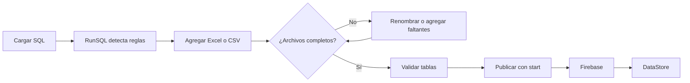
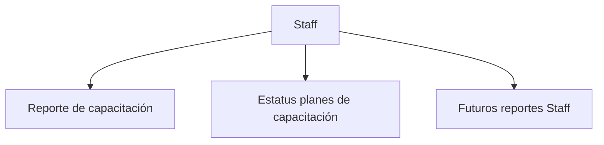

# Manual de usuario · RunSQL

> [!NOTE]
> RunSQL transforma archivos Excel o CSV mediante un proceso SQL y publica el resultado en DataStore. El trabajo habitual se resume en tres acciones: cargar, validar y publicar.

---

## Inicio rápido

### 1. Abre RunSQL

En macOS, abre `start-mac.command`. En Windows, abre `start-windows.bat`.

Cuando la aplicación esté lista verás dos espacios principales:

| Área | Para qué sirve |
|---|---|
| **Biblioteca** | Contiene el proceso SQL y sus archivos Excel o CSV. |
| **Terminal** | Ejecuta comandos, muestra validaciones y confirma la publicación. |

### 2. Carga el proceso SQL

Escribe en la terminal:

```text
upload
```

Selecciona el archivo `.sql` correspondiente. RunSQL lo analiza y construye automáticamente la lista de documentos requeridos.

### 3. Agrega los archivos

Arrastra los archivos Excel o CSV hacia la Biblioteca. También puedes utilizar el botón para agregar documentos.

Los nombres deben coincidir con las reglas del proceso. RunSQL ignora diferencias entre mayúsculas, minúsculas y acentos.

```text
Plan de Capacitación Staff.xlsx
Staff P12.xlsx
Datos Tienda.xlsx
Encuesta de satisfacción.xlsx
```

> [!TIP]
> Si un documento aparece como pendiente, haz doble clic sobre su nombre para renombrarlo. En cuanto coincida con una regla, RunSQL lo asignará automáticamente.

### 4. Publica el corte

Usa el comando correspondiente al tipo de reporte.

```text
start --d(2026-08-31) --t(c) --n(Reporte de capacitación) --l(Staff)
```

Una publicación correcta termina con un mensaje similar a:

```text
listo en 12.4 s: Corte publicado: Reporte de capacitación · colección Staff
```

---

## Flujo completo



### Qué ocurre durante la publicación

1. RunSQL relaciona cada archivo con la tabla indicada por el SQL.
2. DuckDB ejecuta las transformaciones en memoria.
3. Se generan resúmenes, filtros, históricos y detalles.
4. Los resultados se dividen en bloques optimizados.
5. Firebase recibe el nuevo corte.
6. DataStore muestra el reporte dentro de su colección.

> [!IMPORTANT]
> La confirmación válida es el mensaje **Corte publicado** o **Corte reemplazado**. Cargar archivos o previsualizar una tabla no publica información.

---

## Comando `start`

### Estructura

```text
start --d(fecha) --t(tipo) --n(nombre) --l(colección)
```

Las opciones pueden escribirse en cualquier orden.

| Parámetro | Obligatorio | Significado | Ejemplo |
|---|:---:|---|---|
| `--d(fecha)` | Sí | Fecha de corte en formato `AAAA-MM-DD`. | `--d(2026-08-31)` |
| `--t(tipo)` | Recomendado | Estructura del reporte: `c`, `s` o `e`. | `--t(e)` |
| `--n(nombre)` | No | Nombre visible del reporte en DataStore. | `--n(Estatus planes de capacitación)` |
| `--n(nombre actual, nombre nuevo)` | No | Reemplaza el reporte actual y cambia su nombre visible sin crear un duplicado. | `--n(Estatus planes de capacitación, Dirección de Administración GC)` |
| `--l(colección)` | No | Colección en la que aparecerá como capítulo o pestaña. | `--l(Staff)` |

### Tipos de reporte

| Tipo | Letra | Qué publica | Uso típico |
|---|:---:|---|---|
| Capacitación | `c` | Avance, asignaciones, pendientes, puestos, regiones y cursos. | Planes y reportes de capacitación. |
| Satisfacción | `s` | ISA, NPS, respuestas, instructores, programas y comentarios. | Encuesta de satisfacción. |
| Estatus administrativo | `e` | Presupuesto, inversión, cotizaciones, capacitaciones, pagos y direcciones C‑Level. | Estatus de planes de capacitación EIC. |

> [!WARNING]
> No mezcles estructuras. Un SQL administrativo debe publicarse con `--t(e)` y una encuesta con `--t(s)`. Si se omite el tipo, RunSQL conserva las reglas anteriores por compatibilidad, pero para procesos nuevos conviene indicarlo siempre.

### Ejemplos listos para usar

#### Reporte de capacitación

```text
start --d(2026-08-31) --t(c) --n(Reporte de capacitación Staff) --l(Staff)
```

#### Encuesta de satisfacción

```text
start --d(2026-08-31) --t(s) --n(Encuesta de satisfacción)
```

#### Estatus de planes de capacitación

```text
start --d(2026-08-31) --t(e) --n(Estatus planes de capacitación) --l(Staff)
```

#### Proceso compatible con la configuración histórica

```text
start --d(2026-08-31)
```

---

## Cómo funcionan el nombre, la colección y el periodo

### Nombre del reporte

`--n(...)` controla el nombre que verá la persona en DataStore. Permite conservar el nombre técnico del archivo SQL sin mostrarlo en el reporte.

```text
EIC Administrativa.sql
        ↓
--n(Estatus planes de capacitación)
        ↓
Estatus planes de capacitación
```

### Colección

`--l(...)` enlaza el reporte con una colección existente. No mezcla ni sobrescribe otros reportes de esa colección.



Cada reporte conserva:

- Su nombre.
- Su estructura.
- Sus periodos.
- Sus filtros.
- Su información publicada.

### Periodo

La fecha de corte se transforma en el periodo mensual del reporte:

\[
\operatorname{Periodo}(2026\text{-}08\text{-}31)=2026\text{-}08
\]

Si vuelves a publicar la misma categoría y el mismo periodo, RunSQL reemplaza el corte anterior.

> [!CAUTION]
> Verifica la fecha antes de ejecutar. Una fecha incorrecta puede publicar el corte dentro de otro mes o reemplazar un periodo que no corresponde.

---

## Carga y reconocimiento de archivos

### Formatos aceptados

- `.xlsx`
- `.xlsm`
- `.csv`

El proceso SQL puede cargarse como `.sql` o `.txt`.

### Archivos fijos

Son documentos con un nombre esperado por el proceso:

```text
Datos Tienda.xlsx
Plan de Capacitación Almacenista.xlsx
Encuesta de satisfacción.xlsx
```

### Familias de periodos `P(x)`

RunSQL reconoce archivos periódicos de manera flexible:

```text
Almacenista P1.xlsx
Almacenista P2.xlsx
Almacenista P12.xlsx
Staff P7.xlsx
Staff P8.xlsx
```

Puedes cargar uno o varios periodos siempre que el proceso los admita.

### Archivo sin asignar

Un archivo queda pendiente cuando su nombre no coincide con ninguna regla.

Para corregirlo:

1. Haz doble clic en el nombre.
2. Escribe el nombre esperado.
3. Conserva la extensión original.
4. Presiona Enter.

RunSQL no ejecutará mientras existan archivos sin asignar.

---

## Validar antes de publicar

### Ver las tablas generadas

```text
show tables
```

Este comando enumera las tablas y vistas creadas por el proceso SQL.

### Previsualizar una tabla

```text
show eic_resumen_c_level limit 20
```

La previsualización admite entre 1 y 1,000 filas.

Ejemplos:

```text
show resultados_capacitacion_staff limit 25
show eic_resumen_direccion limit 50
show eic_resumen_iniciativa limit 100
```

### Ejecutar una consulta de revisión

Puedes escribir directamente una consulta que comience con `SELECT` o `WITH`:

```sql
SELECT
    direccion_c_level,
    SUM(presupuesto_autorizado_mxn) AS presupuesto,
    SUM(inversion_actual_mxn) AS inversion
FROM eic_resumen_c_level
GROUP BY direccion_c_level
ORDER BY presupuesto DESC;
```

### Descargar el resultado

```text
download
```

- Si el SQL generó archivos Excel, descarga esos archivos.
- Si existe una tabla visible, descarga el resultado como CSV.

> [!TIP]
> Usa `show` para comprobar nombres, totales y estatus. Usa `start` únicamente cuando estés listo para actualizar DataStore.

---

## Indicadores principales

### Reportes de capacitación

\[
\text{Pendientes}=\text{Total asignado}-\text{Completados}
\]

\[
\text{Avance}=\frac{\text{Completados}}{\text{Total asignado}}\times100
\]

### Estatus administrativo EIC

\[
\text{Avance presupuestal}=\frac{\text{Inversión actual}}{\text{Presupuesto autorizado}}\times100
\]

\[
\text{Avance contable}=\frac{\text{Monto cargado al centro}}{\text{Presupuesto autorizado}}\times100
\]

### Encuesta de satisfacción

\[
\operatorname{NPS}=\%\text{ Promotores}-\%\text{ Detractores}
\]

> [!NOTE]
> RunSQL calcula y publica los datos. DataStore decide cómo presentarlos visualmente y qué filtros aplicar en cada tipo de reporte.

---

## Terminal: referencia rápida

| Comando | Resultado |
|---|---|
| `upload` | Abre el selector para cargar un SQL. |
| `start --d(...)` | Ejecuta y publica el corte en Firebase. |
| `show tables` | Lista las tablas generadas. |
| `show <tabla> limit <x>` | Previsualiza una tabla. |
| `SELECT ...` | Ejecuta una consulta de lectura. |
| `WITH ... SELECT ...` | Ejecuta una consulta de lectura con CTE. |
| `download` | Descarga el último resultado. |
| `clear` | Limpia terminal y resultado visible. |
| `help` | Muestra la ayuda integrada. |
| `↑` / `↓` | Recorre comandos anteriores. |

---

## Mensajes y solución de problemas

| Mensaje | Qué significa | Cómo resolverlo |
|---|---|---|
| `falta --d(AAAA-MM-DD)` | No se indicó una fecha válida. | Agrega, por ejemplo, `--d(2026-08-31)`. |
| `--t solo admite c, s o e` | El tipo no existe. | Usa `c`, `s` o `e` en minúscula o mayúscula. |
| `la opción está repetida` | El mismo parámetro aparece dos veces. | Conserva una sola versión de cada opción. |
| `Faltan archivos requeridos` | El SQL necesita documentos que no se cargaron. | Revisa la Biblioteca y agrega los faltantes. |
| `Renombra antes de ejecutar` | Hay archivos sin regla asignada. | Haz doble clic y corrige sus nombres. |
| `backend todavía no está disponible` | FastAPI no inició o dejó de responder. | Reinicia RunSQL con el iniciador de tu sistema. |
| `tabla ... no existe` | El nombre usado en `show` no fue generado. | Ejecuta `show tables` y copia el nombre correcto. |
| `Firebase rechazó la publicación` | La cuenta de servicio no tiene acceso o no está configurada. | Verifica el archivo `.env`, la ruta de la credencial y los permisos del proyecto. |
| `Decimal is not JSON serializable` | Se está usando una versión anterior de RunSQL. | Actualiza o reinicia RunSQL con la versión actual. |
| `Referenced column ... not found` | El Excel cambió el encabezado o el SQL no corresponde a esa versión. | Confirma el archivo fuente y utiliza el SQL actualizado. |
| `tabla parametros_<categoría> con fecha_corte` | Se aplicó una estructura de capacitación a otro reporte. | Indica el tipo correcto, por ejemplo `--t(e)`. |
| `archivos juntos superan el límite` | La carga excede el máximo de la ejecución. | Reduce los archivos o ejecuta el proceso localmente. |

### Si DataStore no muestra el corte

Comprueba, en este orden:

- [ ] La terminal terminó con **Corte publicado** o **Corte reemplazado**.
- [ ] La fecha `--d(...)` corresponde al periodo que estás consultando.
- [ ] El nombre `--n(...)` es el esperado.
- [ ] La colección `--l(...)` está escrita correctamente.
- [ ] El tipo `--t(...)` corresponde al proceso.
- [ ] DataStore fue actualizado o recargado después de la publicación.

---

## Publicaciones y reemplazos

| Situación | Resultado |
|---|---|
| Categoría nueva + periodo nuevo | Se crea un corte. |
| Categoría existente + periodo nuevo | Se agrega el mes al histórico. |
| Misma categoría + mismo periodo | Se reemplaza el corte anterior. |
| Mismo `--l(...)` + distinto `--n(...)` | Se agrega otro capítulo a la colección. |
| Sin `--l(...)` | El reporte aparece de forma independiente. |

> [!IMPORTANT]
> `--l(Staff)` no convierte todos los reportes en uno solo. Únicamente los organiza bajo la misma colección; cada uno conserva su formato y sus datos.

---

## Límites y seguridad

- Las consultas directas sólo aceptan `SELECT` o `WITH`.
- El SQL puede crear tablas, vistas y macros temporales dentro de DuckDB.
- Se bloquean instrucciones destructivas y accesos externos no permitidos.
- Los archivos se procesan en memoria durante la ejecución.
- En local, cada archivo admite hasta 200 MB y la ejecución completa hasta 500 MB.
- La vista previa del navegador se limita a 10,000 filas.
- En un despliegue serverless, el límite de transferencia puede ser considerablemente menor.

> [!WARNING]
> La credencial privada de Firebase pertenece únicamente al backend. No la pegues en el navegador, en el SQL, en capturas de pantalla ni en documentación compartida.

---

## Lista de control antes de publicar

- [ ] Cargué el SQL correcto.
- [ ] Todos los archivos están asignados.
- [ ] No hay documentos requeridos pendientes.
- [ ] Revisé las tablas principales con `show`.
- [ ] Confirmé la fecha de corte.
- [ ] Elegí el tipo correcto: `c`, `s` o `e`.
- [ ] Verifiqué el nombre visible.
- [ ] Verifiqué la colección.
- [ ] Esperé el mensaje final de publicación.
- [ ] Revisé el resultado en DataStore.

---

## Plantillas recomendadas

```text
# Capacitación
start --d(AAAA-MM-DD) --t(c) --n(Nombre del reporte) --l(Colección)

# Satisfacción
start --d(AAAA-MM-DD) --t(s) --n(Encuesta de satisfacción)

# Estatus administrativo EIC
start --d(AAAA-MM-DD) --t(e) --n(Estatus planes de capacitación) --l(Staff)
```

> [!TIP]
> Conserva una copia de la plantilla que utilices cada mes. Cambia únicamente la fecha cuando el nombre, la colección y el tipo del proceso permanezcan iguales.
